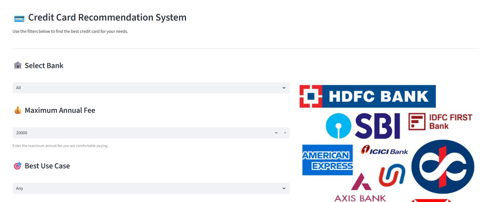

# 💳 Credit Card Recommendation System  
A smart, data-driven credit card recommendation platform built using **Python, Pandas, and Streamlit**, integrating a curated dataset of **177+ real credit cards** from major Indian banks and AMEX.

---

## 🖼️ Project Preview

### 🎬 Intro Animation  

### 🖥️ Streamlit App Screenshot  

---

## 🚀 Overview

This project helps users choose the **best credit card** based on their:
- Annual fee budget  
- Spending habits  
- Best use case (shopping, travel, lifestyle, etc.)  
- Lifetime free preference  
- Bank selection  

It functions like a **mini credit card comparison website**, but fully customizable.

---

## ✨ Features

### 🔍 Smart Filtering System  
Users can filter cards based on:
- Bank  
- Maximum annual fee  
- Best use case  
- Lifetime free option  

### 🟢 Intelligent Badge System  
Automatically labels each card:
- 🟢 **Lifetime Free**  
- 🟡 **Affordable** (₹1–₹2000)  
- 🔵 **Mid-Tier** (₹2001–₹5000)  
- ✨ **Premium** (₹5000+)

### ▶️ One-Time Intro Animation  
A custom MP4 animation (created in Canva) plays only once to enhance app experience.

### 🎨 Clean & Modern UI  
- All filters organized in vertical layout  
- Image/animation on the right side  
- Clean table with renamed columns  
- Works smoothly on Streamlit Cloud  

### ☁️ Deployed Online  
Hosted using **Streamlit Cloud** with GitHub CI deployment.

---

## 🗂️ Tech Stack

| Component | Technology Used |
|----------|------------------|
| Frontend | Streamlit |
| Backend | Python |
| Data Handling | Pandas |
| Deployment | Streamlit Cloud |
| Data Source | Custom dataset of 177+ real credit cards |

---

## 📁 Project Structure

